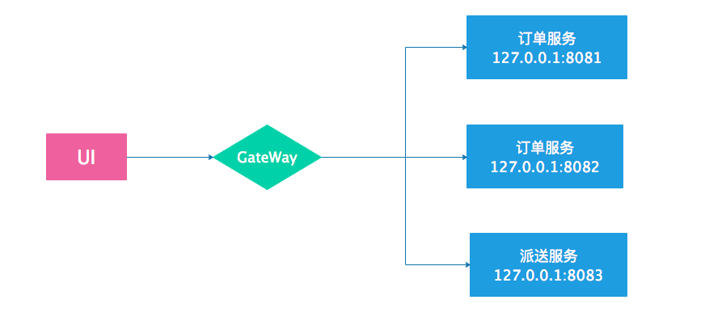
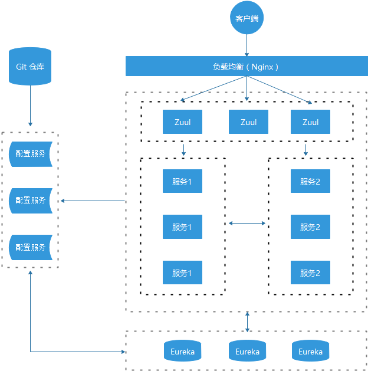
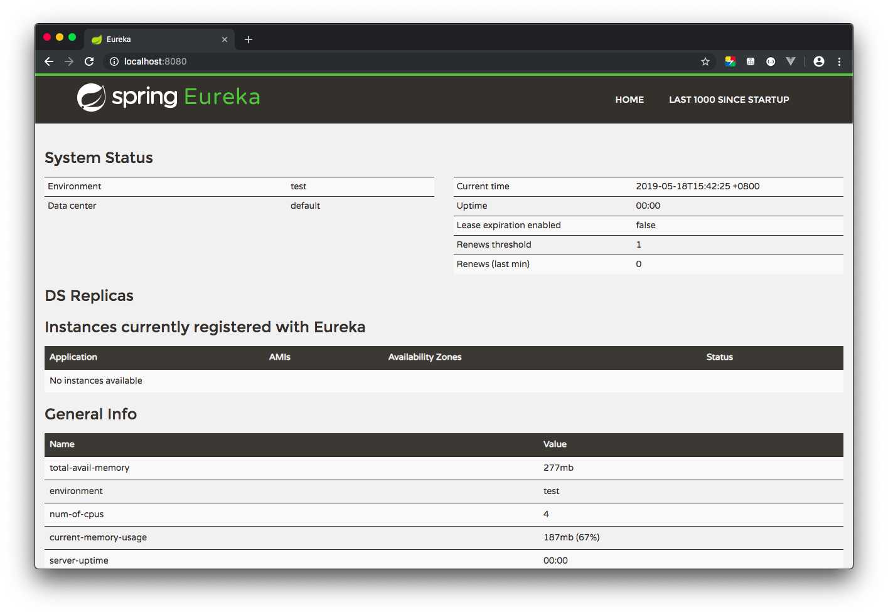
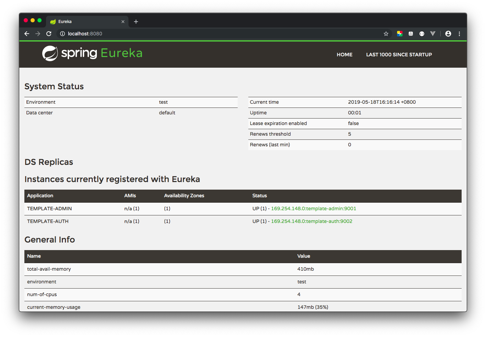
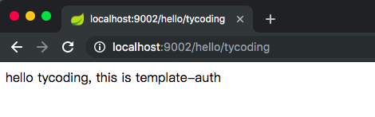
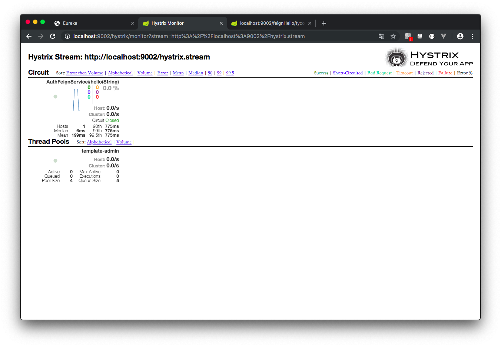
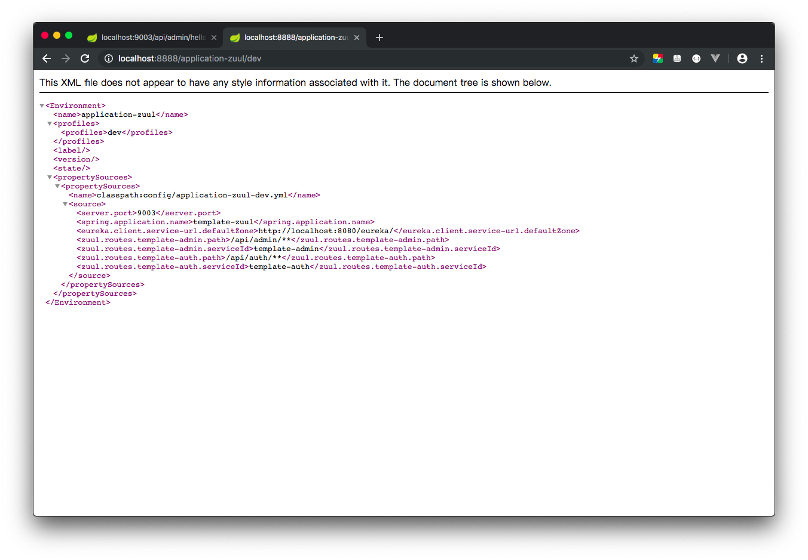
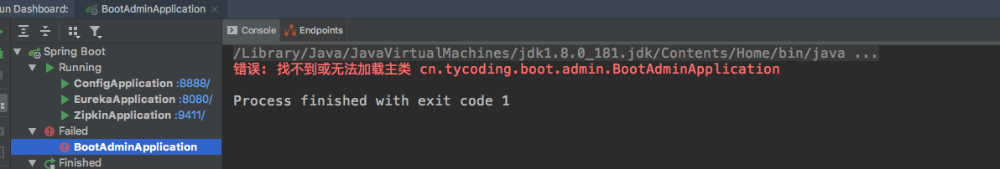
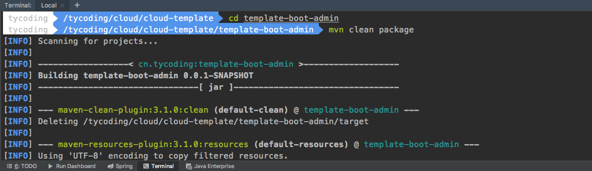
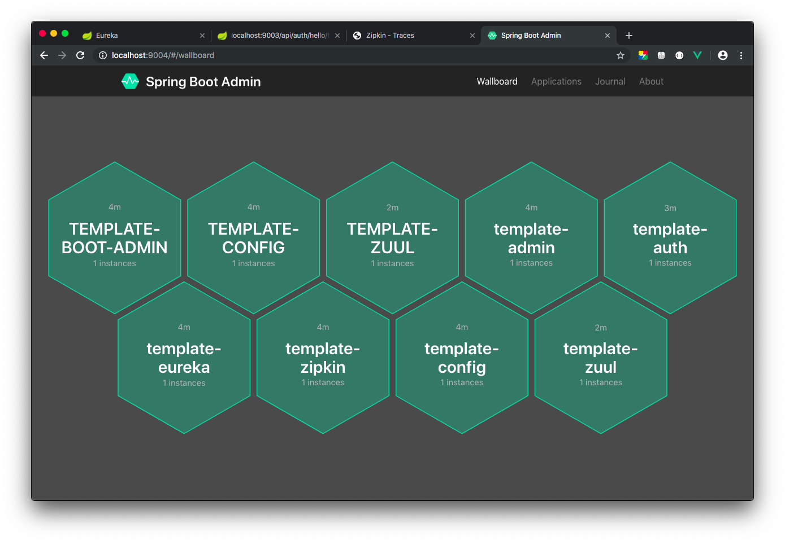

# 从零开始搭建SpringCloud脚手架

# 概念引入

## Eureka

**Eureka:** 服务注册中心。通过Eureka可以监控各个服务的运行状态。它具有如下几个角色：

*   Eureka Server： 提供服务注册与发现
*   Service Provider: 服务提供方。将自身注册到Eureka，供消费者使用
*   Service Consumer:  服务消费方。从Eureka中获取服务器提供方列表，从而消费服务

举个栗子：


>   问题引入：

​		前端APP发送一个请求，此请求需要调用某个服务的接口，比如此时有两个订单服务、一个派送服务 ( 因为要考虑并发，所以通常服务不止一个，而是一个集群 )。上图中前端APP直接请求某个具体服务的接口，如果后端服务集群非常庞大，前端就要记录很多服务的IP地址。并且对于同一服务的集群配置情况，前端APP还需要自行判断到底调用哪个服务。

>   解决办法：

​		显然上述的方式是不可取的。按照之前开发SSM框架前后端不分离时，通常页面直接请求的内部服务接口，从不考虑服务的具体IP地址，因为默认使用的此服务的IP地址。那么在微服务架构中也应该这样设计。所以我们加一个**GateWay网关服务 ( 后面讲 )**，前端APP直接请求请求网关，仅需要记录网关的IP地址即可，这样就将后端服务接口寻址调用的工作交给了服务端完成。举个栗子：



>   问题引入：

​		虽然使用了网关让前端APP直接调用网关地址，由网关负责具体的接口寻址调用，从而减轻了前端的负担。但是，同样，网关也仍然需要知道所有服务的IP地址和对应的接口，并且对于同一服务集群配置的情况仍然要考虑到底调用哪个服务才能分摊请求压力。

>   解决办法：

​		所以，需要一个服务，他能记录系统中所有的微服务IP地址；并且有类似负载均衡的算法，对于服务集群配置，该服务能知道调用哪些服务才能平均分配请求的压力；并且，如果哪个服务崩溃，该服务还能快速知道并不再向崩溃的服务发送请求。于是，**Eureka**诞生了。


Eureka是服务注册中心，其他具体服务可以向这个Eureka注册中心注册自己。当前端发送请求时，首先前端APP会直接请求网关，当然网关服务也注册在Eureka注册中心上，然后网关把接收到的请求交由Eureka处理，Eureka接收到这些请求，会从自己的服务注册列表中寻找对应的服务地址，然后实现调用具体的服务。

## Feign

>   问题引入：

​		在上面的介绍中，我们基本解决了前端APP调用后端服务集群的问题。但又必须考虑一个问题，分布式微服务项目，即各个服务相互独立，但是各个服务又存在相互调用的关系。如何解决服务于服务之间的通信呢？

>   解决办法：

​		在微服务架构中，服务于服务的通讯都是基于Http Restful的。SpringCloud有两种调用方式：

*   使用 **Ribbon + RestTemplate**。**Ribbon**是一个负载均衡客户端，可以很好的控制Http和Tcp的一些行为。而**RestTemplate**是Spring本身提供的用于远程调用Rest接口的HTTP客户端。
*   使用 **Feign**。**Feign**是一个声明式的HTTP客户端，仅需要一个**@FeignClient**注解就能实现远程调用。**Feign**默认集成了**Ribbon**，并和Eureka结合，默认实现了负载均衡的效果。

## Hystrix

>   问题引入：

​		在集群项目中，如果突然某个服务因为访问压力过大崩溃了，Eureka再调用该服务就会调用失败，并且如果该服务向下还存在与其他服务的关联，那么就会造成其他服务也不可用，从而使错误传递下去，这也就是**雪崩效应**。如何解决呢？

>   解决办法：

​		**Hystrix**的出现就是解决这一现象。**Hystrix**熔断器就像家用电闸中的保险丝，如果整个电路中某处发生了漏电、或者用电过高保险丝就会直接熔断，直接停电阻止事态恶化。如果集群中某个服务不可用、或者响应时间过长，Hystrix会直接阻断Eureka再调用此服务，从而避免了系统中所有服务都不可用。

## Hystrix-Dashboard

>   问题引入：

​		上面介绍了使用**Hystrix**实现熔断服务，但作为开发者，我们并不能确定服务什么时候被熔断。

>   解决办法：

​		提供了`hystrix-dashboard`工具实现实时监控Hystrix熔断器的状态。

## Zuul

**Zuul**路由网关。举个栗子：



如上是一个基本的微服务架构图，先抛开左侧的配置服务，如果前端APP请求后台接口，显然前端无法记录后端那么多服务的API地址，按照SSM框架的开发思路，前端APP仅需要记录一个IP地址即可，所有的请求都应该是请求这个IP中的某个接口。

那么**Zuul**路由网关的作用就是如此，他实现将客户端**按照一定约束**的不同请求转发到对应的服务，这样就实现客户端仅记录一个IP地址就能实现请求不同服务的接口。

## Config

如果系统服务模块非常多时，每次修改服务配置都要修改服务`src/main/resources`下的`application.yml`可能会很麻烦，`spring-cloud-config`就解决了这个问题，Config Server端实现将配置文件内容以接口的形式暴露，Client端通过该接口得到配置文件内容，并以此初始化自己的应用。

## ZipKin

**ZipKin** 服务链路追踪。可以追踪系统中服务间的依赖调用关系，查看调用的详细数据，收集服务的详细数据。提供 **Zipkin UI** 可以轻松的在Web端收集和分析数据。

## Spring-Boot-Admin

**Spring Boot Admin** 实现堆各个微服务的健康状态、会话数量、并发数、服务资源、延迟等信息的收集，是一套强大的监控管理系统

# 项目实战

本地创建一个空文件夹，使用IDEA打开这个文件夹，并在其中创建`pom.xml`文件


`pom.xml`

```xml
<?xml version="1.0" encoding="UTF-8"?>
<project xmlns="http://maven.apache.org/POM/4.0.0" xmlns:xsi="http://www.w3.org/2001/XMLSchema-instance"
         xsi:schemaLocation="http://maven.apache.org/POM/4.0.0 http://maven.apache.org/xsd/maven-4.0.0.xsd">
    <modelVersion>4.0.0</modelVersion>
    <parent>
        <groupId>org.springframework.boot</groupId>
        <artifactId>spring-boot-starter-parent</artifactId>
        <version>2.1.5.RELEASE</version>
    </parent>
    <groupId>cn.tycoding</groupId>
    <artifactId>template</artifactId>
    <version>0.0.1-SNAPSHOT</version>
    <name>template</name>

    <properties>
        <java.version>1.8</java.version>
        <spring-cloud.version>Greenwich.SR1</spring-cloud.version>
    </properties>

    <dependencies>

        <dependency>
            <groupId>org.springframework.boot</groupId>
            <artifactId>spring-boot-starter-test</artifactId>
            <scope>test</scope>
        </dependency>
    </dependencies>

    <dependencyManagement>
        <dependencies>
            <dependency>
                <groupId>org.springframework.cloud</groupId>
                <artifactId>spring-cloud-dependencies</artifactId>
                <version>${spring-cloud.version}</version>
                <type>pom</type>
                <scope>import</scope>
            </dependency>
        </dependencies>
    </dependencyManagement>

    <build>
        <plugins>
            <plugin>
                <groupId>org.springframework.boot</groupId>
                <artifactId>spring-boot-maven-plugin</artifactId>
            </plugin>
        </plugins>
    </build>
</project>
```

## 搭建Eureka服务

Eureka是服务注册中心，但它自己同样也是一个服务。

1.  和上面一样，在`cloud-template`文件夹下创建`template-eureka`文件夹

2.  创建该服务的启动器类：`EurekaApplication` 

```java
@EnableEurekaServer
@SpringBootApplication
public class EurekaApplication {

    public static void main(String[] args) {
        SpringApplication.run(EurekaApplication.class, args);
    }
}
```

仅需要添加`@EnableEurekaServer`就告诉了Spring这个服务的Eureka服务注册中心。

3.  在`cloud-template`父工程`pom.xml`中新增一个节点

```xml
    <modules>
        <module>template-eureka</module>
    </modules>
```

4.  创建`application.yml`配置文件

```yaml
spring:
  application:
    # 应用名称
    name: template-eureka

server:
  port: 8080

eureka:
  instance:
    # Eureka注册中心HOST主机地址，可以采用：1.直接配置IP；2.配置本地域名并修改本地hosts文件
    hostname: localhost
  client:
    # 是否将自己注册到注册中心。因为项目中只有一个注册中心就是自己，所以无需再注册
    register-with-eureka: false
    # 是否从远程拉取其他注册中心，因为注册中心只有自己所以不需要。如果注册中心有多个，可以相互暴露，相互拉取
    fetch-registry: false
    service-url:
      # 该注册中心连接地址
      defaultZone: http://${eureka.instance.hostname}:${server.port}/eureka/
```


5.  启动`EurekaApplication.java`中的main方法，浏览器访问：`localhost:8080`



可以看到此时没有任何服务注册到Eureka注册中心。

## 搭建生产者服务

1.  在`cloud-template`下创建`template-admin`文件夹
2.  创建`pom.xml`，主要添加一个依赖

```xml
<dependency>
    <groupId>org.springframework.cloud</groupId>
    <artifactId>spring-cloud-starter-netflix-eureka-server</artifactId>
</dependency>
```

3.  在父工程`cloud-template`的`pom.xml`中再添加一个节点

```xml
    <modules>
        <module>template-eureka</module>
        <module>template-admin</module>
    </modules>
```

4.  创建该服务的启动器类：`AdminApplication.java`

```java
@EnableEurekaClient
@SpringBootApplication
public class AdminApplication {

    public static void main(String[] args) {
        SpringApplication.run(AdminApplication.class, args);
    }
}
```

只需要添加注解`@EnableEurekaClient`就表明该服务Eureka的一个服务提供方。

5.  创建配置文件`application.yml`

```yaml
server:
  port: 9001

spring:
  application:
    name: template-admin

eureka:
  client:
    service-url:
      # Eureka注册中心连接地址
      # 如果注册中心地址配置的域名，这里使用 http://域名/eureka/ 格式
      defaultZone: http://localhost:8080/eureka/
```

6.  运行`AdminApplication.java`中的main方法，继续访问`localhost:8080`地址：


可看到，`template-admin`服务已经注册到了Eureka注册中心

7.  在`template-admin`服务中创建一个Controller类：

```java
@RestController
public class AdminController {

    @GetMapping("/hello/{name}")
    public String hello(@PathVariable String name) {
        return "hello " + name + ", this is template-admin";
    }
}
```

8.  重启`template-admin`服务，访问：`localhost:9001/hello/tycoding`:


## 搭建消费者服务

上面搭建了 `template-admin` 生产者服务，它暴露了Rest接口，那么其他服务想要调用生产者服务的接口，就必须实现与生产者服务的通信。最开始**概念引入**部分我们提到了SpringCloud实现服务间通信的两种方式，这里我们直接使用**Feign**实现。

1.  在`cloud-template`下创建`template-auth`文件夹
2.  创建`pom.xml`，主要添加两个依赖：

```xml
<dependency>
    <groupId>org.springframework.cloud</groupId>
    <artifactId>spring-cloud-starter-netflix-eureka-server</artifactId>
</dependency>
<dependency>
    <groupId>org.springframework.cloud</groupId>
    <artifactId>spring-cloud-starter-openfeign</artifactId>
</dependency>
```

3.  在父工程`cloud-template`下再添加一个节点

```xml
    <modules>
        <module>template-eureka</module>
        <module>template-admin</module>
        <module>template-auth</module>
    </modules>
```

4.  创建该服务的启动器类：`AuthApplication.java`

```java
@EnableDiscoveryClient
@EnableFeignClients
@SpringBootApplication
public class AuthApplication {

    public static void main(String[] args) {
        SpringApplication.run(AuthApplication.class, args);
    }
}
```

这里需要注意添加`@EnableDiscoveryClient`注解声明该服务为Eureka中服务消费方；添加`@EnableFeignClients`开启Feign声明式服务间通信（配合`@FeignClient`注解使用）。

5.  创建配置文件`application.yml`

```yaml
server:
  port: 9002

spring:
  application:
    name: template-auth

eureka:
  client:
    service-url:
      # Eureka注册中心连接地址
      # 如果注册中心地址配置的域名，这里使用 http://域名/eureka/ 格式
      defaultZone: http://localhost:8080/eureka/
```

6.  模拟创建一个Controller：`AuthController.java`

```java
@RestController
public class AuthController {

    @GetMapping("/hello/{name}")
    public String hello(@PathVariable String name) {
        return "hello " + name + ", this is template-auth";
    }
}
```

 

7.  启动项目，访问`localhost:8080`



可以看到该服务已经注册到了Eureka注册中心了。继续访问`localhost:9002/hello/tycoding`：



8.  在`template-auth`服务下创建`feign/service`文件夹，并在其中创建`AuthFeignService.java`接口：

```java
@FeignClient(value = "template-admin")
public interface AuthFeignService {

    /**
     * 这里暴露一个Feign接口地址，其中`@GetMapping`中的地址一定对应了`template-admin`服务中某个Controller中的请求地址（如果`template-admin`服务中没有这个接口地址就会404）
     * 如果其他地方调用了AuthFeignService接口的hello方法，FeignClient将类似通过转发的方式去请求调用`template-admin`服务中符合的接口地址的方法
     * 如果请求传递了参数，需要加@RequestParam注解标识。如果URL中有动态参数，要添加@PathVariable注解
     *
     * @param name
     * @return
     */
    @GetMapping("/hello/{name}")
    public String hello(@PathVariable(name = "name") String name);
}
```

如上，这是一个供Feign调用的接口。Feign实现服务端通信有几个基本条件：

-   该服务添加了`spring-cloud-starter-openfeign`依赖
-   该服务的启动器类上添加了`@EnableFeignClients`注解
-   该服务提供了一个接口类，并在该接口上添加了`@FeignClient`注解，并且`@FeignClient`注解中`value`属性值必须等于一个已在Eureka中注册的服务名称。
-   在该接口上添加一个调用的方法，该方法必须和被调用服务方Controller中的方法格式相同(除了没有方法具体实现，方法的返回值、参数列表都要相同)，并且需要和被调用方Controller接口一样在方法上添加`@RequestMapping`注解，指明被调用方接口的具体URL。

9.  修改`template-auth`服务中的`AuthController`类，添加一个请求接口：

```java
@RestController
public class AuthController {

    @Autowired
    private AuthFeignService authFeignService;

    /**
     * 模拟Feign远程调用，这里暴露一个请求接口`/feignHello`
     * 这个请求接口将调用`AuthFeignService`（Feign接口）
     * Feign接口（`AuthFeignService`接口）将会通过`@FeignClient(value = "template-admin")`在Eureka注册中心寻找`template-admin`模块
     * Feign接口类似Controller的Rest接口，也暴露一个地址，这个地址对应`template-admin`模块的一个Controller接口地址
     *
     * @param name
     * @return
     */
    @GetMapping("/feignHello/{name}")
    public String feignHello(@PathVariable String name) {
        return authFeignService.hello(name);
    }

}
```

如上，这个`/feignHello/{name}`请求接口将调用`AuthFeignService`的`hello`方法，而`AuthFeignService`的`hello`方法最终由Feign调用`template-admin`中的`/hello`请求接口。

所以，`template-auth`服务中的`/feignHello/{name}`接口最终调用了`template-admin`服务中的`/hello/{name}`接口。重启`template-auth`服务，访问：`localhost:9002/feignHello/tycoding`:


显然，我们的分析都是正确的，使用Feign声明式服务调用，仅通过`@FeignClient`注解就能完成服务间通信。

## 配置Hystrix熔断机制

前面提到了Hystrix主要用于在多个服务间存在通信，而通信的某一方因为压力过大、响应时间过长而导致不可用，Hystrix就会阻止Eureka再给该服务分配请求，从而保证服务的高可用。

因此，Hystrix主要配置在存在服务间通信的地方。因为我们使用的Feign，Feign正是用来实现服务间通信的。所以我们只需要在自己创建的Feign接口中配置熔断器即可。因为Feign已经内置了Hystrix，我们只需要配置启用hystrix即可。

1.  修改`template-auth`中的`application.yml`:

```yaml
feign:
  hystrix:
    # 开启Feign的Hystrix熔断器支持
    enabled: true
```

2.  在`/feign/service/fallback`中创建`AuthFeignServiceFallbackImpl.java`:

```java
@Component
public class AuthFeignServiceFallbackImpl implements AuthFeignService {

    @Override
    public String hello(String name) {
        return "hello " + name + ", this is template-auth, but request error";
    }
}
```

这个类实现了`AuthFeignService`远程调用接口，作用就是当`AuthFeignService`调用的服务不可用时，Hystrix直接执行这个实现类中的方法，而不再执行`AuthFeignService`中的远程调用方法。

3.  重启`template-auth`服务，访问`localhost:9002/feignHello/tycoding`发现正常访问。此时关闭`template-admin`服务：


该服务已关闭，继续访问：`localhost:9002/feignHello/tycoding`:


可以看到访问该URL时，浏览器直接显示的`AuthFeignServiceFallbackImpl.java`中的响应数据，而不是再加载一下请求`AuthFeignService.java`中的请求。就是说如果被调用方服务一旦不可用，Hystrix就**立刻**熔断与该服务之间的通信。

## 配置Hystrix-Dashboard

可以通过`hystrix-dashboard`工具实现对熔断器Hystrix的实时监控。因为我们在`template-auth`服务中使用了Feign远程调用，并且使用了Hystrix熔断器，所以我们只需要在`template-auth`服务中配置熔断监控：

1.  引入依赖

```xml
<dependency>
    <groupId>org.springframework.cloud</groupId>
    <artifactId>spring-cloud-starter-netflix-hystrix-dashboard</artifactId>
</dependency>
```

2.  在`template-auth`启动器类上添加`@EnableHystrixDashboard`注解

```java
@EnableDiscoveryClient
@EnableFeignClients
@EnableHystrixDashboard
@SpringBootApplication
public class AuthApplication {

    public static void main(String[] args) {
        SpringApplication.run(AuthApplication.class, args);
    }
}
```

3.  在`/config`文件夹下创建`HystrixDashboardConfig.java`:

```java
@Configuration
public class HystrixDashboardConfig {

    @Bean
    public ServletRegistrationBean getServlet() {
        HystrixMetricsStreamServlet streamServlet = new HystrixMetricsStreamServlet();
        ServletRegistrationBean registrationBean = new ServletRegistrationBean(streamServlet);
        registrationBean.setLoadOnStartup(1);
        registrationBean.addUrlMappings("/hystrix.stream");
        registrationBean.setName("HystrixMetricsStreamServlet");
        return registrationBean;
    }
}
```

如果项目中添加了`spring-cloud-starter-netflix-hystrix-dashboard`依赖，此依赖提供了 `/hystrix` 接口地址，这是访问`hystrix-dashboard`的入口地址。但是`hystrix-dashboard`需要监控某个Hystrix熔断器地址，那么这个监控地址哪来呢？

在SpringBoot2.x之前的版本中，SpringBoot默认提供了一个接口地址用于访问Hystrix熔断器。但是在SpringBoot2版本中需要手动提供一个Hystrix监控地址。上面的配置就是将Servlet ( HystrixMetricsStreamServlet )注入到Web容器中，类似`web.xml`中的`<servlet-mapping>`和`<servlet-name>`。

4.  重启`template-auth`服务，访问：`localhost:9002/hystrix`


在上面输入`localhost:9002/hystrix.stream`，其中Delay是每隔几毫秒刷新一次


显示Loading说明连接成功，但是因为没有触发Hystrix熔断器，所以监控没有显示数据。我们继续访问：`localhost:9002/feignHello/tycoding`，重复刷新4次网页：



因为，所有的服务都是启动的，所以熔断器没有熔断。此时关掉`template-admin`服务，再次刷新`localhost:9002/feignHello/tycoding`接口10次：


## 配置Zuul路由网关

1.  在`cloud-template`下创建`template-zuul`文件夹

2.  创建`pom.xml`，主要添加两个依赖：

```xml
<dependency>
    <groupId>org.springframework.cloud</groupId>
    <artifactId>spring-cloud-starter-netflix-eureka-server</artifactId>
</dependency>
<dependency>
    <groupId>org.springframework.cloud</groupId>
    <artifactId>spring-cloud-starter-netflix-zuul</artifactId>
</dependency>
```

3.  在父工程`cloud-template`的`pom.xml`下添加一个节点：

```xml
    <modules>
        <module>template-eureka</module>
        <module>template-admin</module>
        <module>template-auth</module>
        <module>template-zuul</module>
    </modules>
```

4.  创建该服务的启动器类：`ZuulApplication.java`

```java
@EnableZuulProxy
@EnableEurekaClient
@SpringBootApplication
public class ZuulApplication {

    public static void main(String[] args) {
        SpringApplication.run(ZuulApplication.class, args);
    }
}
```

其中`@EnableEurekaClient`表明此服务是Eureka的客户端，也就是此服务需要注册到Eureka注册中心；而注解`@EnableZuulProxy`就是开启Zuul网关的支持。

4.  创建配置文件：`application.yml`

```yaml
server:
  port: 9003

spring:
  application:
    name: template-zuul

eureka:
  client:
    service-url:
      # Eureka注册中心连接地址
      # 如果注册中心地址配置的域名，这里使用 http://域名/eureka/ 格式
      defaultZone: http://localhost:8080/eureka/

zuul:
  routes:
    # 路由名称，随意
    template-admin:
      # 路由地址
      path: /api/admin/**
      # 该路由地址对应的服务名称
      serviceId: template-admin
    template-auth:
      path: /api/auth/**
      serviceId: template-auth
```

其中，`zuul.routers`下可以配置多个路由表，每个路由表中对应了具体的请求路径前缀`path`，这个请求路径最终会被Zuul路由到某个服务中，所需需要对应配置一个`serviceId`对应某个服务的名称。这样就实现了请求`/api/admin/xx`接口Zuul就会将请求转发到`template-admin`服务、请求`/api/auth/xx`接口Zuul就会将请求转发到`template-auth`服务。

5.  按照`template-eureka` 、`template-zuul`、`template-admin`、`template-auth`的顺序启动项目。

-   访问：`localhost:9003/api/admin/hello/tycoding`:


-   访问：`localhost:9003/api/auth/hello/tycoding`:


-   访问：`localhost:9003/api/auth/feignHello/tycoding`:


如此，通过`template-zuul`服务的路由转发功能，实现了仅仅通过请求`9003`这一个IP地址就能访问多个服务的接口。但实际测试中你可能还会遇到如下的错误：


这就是一个服务不可用的现象，Eureka会直接熔断与该服务的链接。而产生的原因与本地电脑的性能有关，所以就可能在项目运行中出现服务链接不上而被Eureka熔断的情况。

### 配置Zuul的错误回调

上面两图中就一个Zuul网关路由错误的情况，而出现错误，肯定不能弹出Spring内置的错误页面，而需要定制一个错误信息，通常是JSON格式。

在`/fallback`目录下创建：`AuthFeignFallbackProvider.java`

```java
@Component
public class AuthFeignFallbackProvider implements FallbackProvider {

    @Override
    public String getRoute() {
        // serviceId，如果需要所有的调用都支持回退，则return "*" 或 return null
        return "template-auth";
    }

    /**
     * 返回定制的错误信息
     *
     * @param route
     * @param cause
     * @return
     */
    @Override
    public ClientHttpResponse fallbackResponse(String route, Throwable cause) {
        return new ClientHttpResponse() {
            @Override
            public HttpStatus getStatusCode() throws IOException {
                return HttpStatus.OK;
            }

            @Override
            public int getRawStatusCode() throws IOException {
                return HttpStatus.OK.value();
            }

            @Override
            public String getStatusText() throws IOException {
                return HttpStatus.OK.getReasonPhrase();
            }

            @Override
            public void close() {

            }

            @Override
            public InputStream getBody() throws IOException {
                ObjectMapper mapper = new ObjectMapper();
                Map<String, Object> map = new HashMap<>();
                map.put("status", 200);
                map.put("message", "链接失败，请检查您的网络");
                return new ByteArrayInputStream(mapper.writeValueAsString(map).getBytes("UTF-8"));
            }

            @Override
            public HttpHeaders getHeaders() {
                HttpHeaders httpHeaders = new HttpHeaders();
                httpHeaders.setContentType(MediaType.APPLICATION_JSON_UTF8);
                return httpHeaders;
            }
        };
    }
}
```

这里要强调一个细节，如果Zuul路由服务失败不应该给客户端返回404、500等错误，因为客户端直接请求的是`template-zuul`路由网关服务，而请求`template-zuul`服务是成功的，`template-zuul`将请求转发到其他服务属于服务器内部错误，这中错误不应该暴露给客户端。除非是`template-zuul`路由网关服务自己挂了，才会返回给客户端404、500等错误。

重启`template-zuul`服务，**立即**访问`localhost:9003/api/auth/feignHello/tycoding`，一般都会链接不上服务：


### 配置Zuul服务过滤器

如果需要对请求进行拦截过滤，比如登录时应该携带Token值才运行请求，那么就可以使用Zuul提供的过滤器功能。

-   在`/filter`目录下创建`LoginFilter.java`

```java
@Component
public class LoginFilter extends ZuulFilter {
    private Logger logger = LoggerFactory.getLogger(this.getClass());

    /**
     * 过滤器类型：
     * pre: 路由前
     * routing: 路由时
     * post: 路由后
     * error: 路由发生错误时
     *
     * @return
     */
    @Override
    public String filterType() {
        return "pre";
    }

    /**
     * 过滤的顺序
     *
     * @return
     */
    @Override
    public int filterOrder() {
        return 0;
    }

    /**
     * 是否需要过滤
     *
     * @return
     */
    @Override
    public boolean shouldFilter() {
        return true;
    }

    /**
     * 过滤器的具体业务逻辑
     *
     * @return
     * @throws ZuulException
     */
    @Override
    public Object run() throws ZuulException {
        RequestContext currentContext = RequestContext.getCurrentContext();
        HttpServletRequest request = currentContext.getRequest();
        logger.info("{} >>> {}", request.getMethod(), request.getRequestURI().toString());
        String token = request.getParameter("token");
        if (token == null) {
            logger.error("Error! Request Token is Empty");
            currentContext.setSendZuulResponse(false);
            currentContext.setResponseStatusCode(401);
            try {
                currentContext.getResponse().getWriter().write("Request token is empty");
            } catch (IOException e) {
                e.printStackTrace();
            }
        }
        return null;
    }
}
```

-   重新启动`template-zuul`服务。访问`localhost:9003/api/admin/hello/tycoding`


访问`localhost:9003/api/admin/hello/tycoding?token=123`


## 搭建Config服务

### Server端

1.  在`cloud-template`下创建文件夹`template-config`
2.  创建`pom.xml`，主要添加以下两个依赖：

```xml
 <dependency>
     <groupId>org.springframework.cloud</groupId>
     <artifactId>spring-cloud-starter-netflix-eureka-server</artifactId>
</dependency>
<dependency>
    <groupId>org.springframework.cloud</groupId>
    <artifactId>spring-cloud-config-server</artifactId>
</dependency>
```

3.  创建配置文件`application.yml`

```yaml
server:
  port: 8888

spring:
  application:
    name: template-config

  # 获取本地配置文件，本身支持：本地储存、git远程、SVN
  profiles:
    active: native

  cloud:
    config:
      server:
        # 获取本地配置文件的位置
        native:
          search-locations: classpath:config/

eureka:
  client:
    service-url:
      # Eureka注册中心连接地址
      # 如果注册中心地址配置的域名，这里使用 http://域名/eureka/ 格式
      defaultZone: http://localhost:8080/eureka/
```

这里使用的本地储存配置文件，也可以采用从远程github、gitlab端读取：

```yaml
  # 远程读取
  cloud:
    config:
      label: master # 配置仓库的分支
      server:
        git:
          uri: https://github.com/xx/spring-cloud-config # 配置Git仓库地址，如果用Github需要加.git，如果用Gitlab则不需要
          search-paths: respo # 配置仓库路径
          username: # 访问Git仓库的账号
          password: # 访问Git仓库的密码
```

4.  创建该服务的启动器类`ConfigApplication.java`

```java
@EnableConfigServer
@EnableEurekaClient
@SpringBootApplication
public class ConfigApplication {

    public static void main(String[] args) {
        SpringApplication.run(ConfigApplication.class, args);
    }
}
```

其中`@EnableConfigServer`就是开启配置文件服务支持

5.  将`template-zuul`服务的配置文件`application.yml`拷贝到服务`template-zuul`的`/resources/config`目录下，重命名为`application-zuul-deb.yml`。
6.  重启`template-zuul`服务，访问`localhost:8888/application-zuul/dev`



如此，就完成了Congi服务端配置。可以看到`application-zuul-dev.yml`文件中的数据已接口的形式可直接通过请求接口访问。注意主要使用`localhost:8888/config/application-zuul-dev.yml`访问，这样就相当于访问静态文件了。

### Client端

因为上面我们copy的`template-zuul`服务的配置文件到`template-config`服务的`/resources/config`文件夹下，所以以`template-zuul`服务举例，让`template-zuul`服务从`template-config`分布式配置中心获取配置文件。

1.  在`template-cloud`服务的`pom.xml`中添加依赖：

```xml
<dependency>
    <groupId>org.springframework.cloud</groupId>
    <artifactId>spring-cloud-starter-config</artifactId>
</dependency>
```

2.  修改`template-cloud`服务的`application.yml`配置文件：

```yaml
spring:
  profiles:
    active: native
  cloud:
    config:
      uri: http://locahost:8888
      name: application-zuul
      profile: dev
#      label:
```

如上，删除了`template-zuul`服务配置文件中原有的配置，这里仅配置从分布式配置中心`template-config`服务中读取配置文件信息。相关参数说明：

-   `spring.cloud.config.uri`: 配置服务中心的网址
-   `spring.cloud.config.name`: 配置文件的前缀名
-   `spring.cloud.config.label`: 配置仓库的分支。如果是本地读取，可不配置
-   `spring.cloud.config.profile`: 配置文件的环境标识
    -   `dev`: 开发环境
    -   `test`: 测试环境
    -   `prod`: 生产环境

3.  重新启动`template-zuul`服务，访问：`localhost:9003/api/admin/hello/tycoding?token=123`


4.  注意事项：

    ​	配置服务器的默认端口是 8888， 如果修改了默认端口，则客户端项目中就不能在`application.yml`或`application.properties`中配置`spring.cloud.config.uri`，必须在`bootstrap.yml`或是`bootstrap.properties`中配置，原因是`bootstrap`开头的配置文件会优先加载和配置。

**开启Spring Boot Profile**

如果项目中分别部署了开发、测试、生产环境的配置文件，但如果切换不同的开发环境就可能要修改对应配置文件中的配置 ( `spring.cloud.config.profile`的参数值 )，而使用Spring Boot Profile就仅需要在启动项目时指定加载的文件，Spring就会自动加载该配置文件来启动项目。举个栗子：

```shell
java -jar template-auth-1.0.0-SNAPSHOT.jar --spring.profiles.active=prod
```

其中`--spring.prodiles.active=prod`就会自动加载`application-auth-prod.yml`配置文件

## 搭建ZipKin服务

### Server端

1.  在`cloud-template`下创建文件夹`template-zipkin`
2.  创建`pom.xml`

```xml
    <dependencies>
        <dependency>
            <groupId>org.springframework.cloud</groupId>
            <artifactId>spring-cloud-starter-netflix-eureka-server</artifactId>
        </dependency>

        <dependency>
            <groupId>io.zipkin.java</groupId>
            <artifactId>zipkin</artifactId>
        </dependency>
        <dependency>
            <groupId>io.zipkin.java</groupId>
            <artifactId>zipkin-server</artifactId>
            <exclusions>
                <exclusion>
                    <groupId>org.apache.logging.log4j</groupId>
                    <artifactId>log4j-slf4j-impl</artifactId>
                </exclusion>
            </exclusions>
        </dependency>
        <dependency>
            <groupId>io.zipkin.java</groupId>
            <artifactId>zipkin-autoconfigure-ui</artifactId>
        </dependency>
    </dependencies>
```

3.  在父工程`pom.xml`中添加ZipKin依赖的版本约定：

```xml
    <properties>
        <java.version>1.8</java.version>
        <spring-cloud.version>Greenwich.SR1</spring-cloud.version>
        <zipkin.version>2.10.1</zipkin.version>
    </properties>

    <modules>
        <module>template-eureka</module>
        <module>template-admin</module>
        <module>template-auth</module>
        <module>template-zuul</module>
        <module>template-config</module>
        <module>template-zipkin</module>
    </modules>

    <dependencyManagement>
        <dependencies>
            <dependency>
                <groupId>org.springframework.cloud</groupId>
                <artifactId>spring-cloud-dependencies</artifactId>
                <version>${spring-cloud.version}</version>
                <type>pom</type>
                <scope>import</scope>
            </dependency>

            <dependency>
                <groupId>io.zipkin.java</groupId>
                <artifactId>zipkin</artifactId>
                <version>${zipkin.version}</version>
            </dependency>
            <dependency>
                <groupId>io.zipkin.java</groupId>
                <artifactId>zipkin-server</artifactId>
                <version>${zipkin.version}</version>
            </dependency>
            <dependency>
                <groupId>io.zipkin.java</groupId>
                <artifactId>zipkin-autoconfigure-ui</artifactId>
                <version>${zipkin.version}</version>
            </dependency>
        </dependencies>
    </dependencyManagement>
```

4.  创建该服务的启动器类`ZipKinApplication.java`

```java
@EnableZipkinServer
@EnableEurekaClient
@SpringBootApplication
public class ZipkinApplication {

    public static void main(String[] args) {
        SpringApplication.run(ZipkinApplication.class, args);
    }
}
```

5.  创建配置文件`pom.xml`

```xml
spring:
  application:
    name: template-zipkin

  # 解决Zipkin启动The bean 'characterEncodingFilter', defined in
  main:
    allow-bean-definition-overriding: true

server:
  port: 9411

eureka:
  client:
    serviceUrl:
      defaultZone: http://localhost:8080/eureka/

management:
  metrics:
    web:
      # 解决Zipkin报错IllegalArgumentException: Prometheus requires that all meters
      server:
        auto-time-requests: false
```

注意：`9411`是默认端口

6.  启动项目，访问：`localhost:9411`


### Client端

如果需要ZipKin监控所有服务的信息，需要让每个服务都成为ZipKin的服务端。

除了`template-zipkin`服务本身，其他的服务全都要成为ZipKin的客户端，以下配置需要在每个服务中都添加：

1.  修改服务的`pom.xml`

```xml
 <dependency>
     <groupId>org.springframework.cloud</groupId>
     <artifactId>spring-cloud-starter-zipkin</artifactId>
</dependency>
```

2.  修改服务的`application.yml`，如果服务的配置文件从`template-config`服务中加载的，就直接在`template-config`中配置该服务：

```yaml
spring:
  zipkin:
    base-url: http://localhost:9411
```

3.  按照`template-eureka`、`template-config`、`template-zipkin`、`template-admin`、`template-auth`、`template-zuul`的顺序依次启动所有服务。访问`localhost:8080`:


访问所有我们之前写好的接口，再访问`localhost:9411`:


比如观察`localhost:9003/api/auth/hello/tycoding?token=123`接口的链路信息：


参数说明：

-   `span`: 基本工作单元
-   `Trace`: 一系列Spans组成的树状结构
-   `Annotation`: 用来即时记录一个时间的存在，比如请求的开始于结束
    -   `cs`: Client Server，客户端发起一个请求，这个Annotation描述了这个Span的开始
    -   `sr`: Server Received，服务端获取请求并开始处理它。`sr - cs`得到网络延迟时间
    -   `ss`: Server Sent 请求处理完成，请求返回客户端。`ss - sr` 得到服务端处理请求的时间
    -   `cr`: Client Received 表明Span的结束，客户端成功接收到服务端的回复。`cr - cs`得到客户端从服务端获取回复花费的总时间。 

## 搭建SpringBootAdmin服务

### Server端

1.  在`cloud-template`下创建`template-boot-admin`文件夹
2.  在`template-boot-admin`下创建`pom.xml`

```xml
<dependency>
    <groupId>org.springframework.cloud</groupId>
    <artifactId>spring-cloud-starter-netflix-eureka-server</artifactId>
</dependency>
<dependency>
    <groupId>org.jolokia</groupId>
    <artifactId>jolokia-core</artifactId>
</dependency>
<dependency>
    <groupId>de.codecentric</groupId>
    <artifactId>spring-boot-admin-starter-server</artifactId>
</dependency>
<dependency>
    <groupId>org.springframework.cloud</groupId>
    <artifactId>spring-cloud-starter-zipkin</artifactId>
</dependency>
```

3.  和ZipKin一样，SpringBootAdmin不受SpringCloud管理，所以要手动管理版本。修改父工程`pom.xml`:

```xml
<properties>
    <spring-boot-admin.version>2.1.5</spring-boot-admin.version>
</properties>
<dependencyManagement>
    <dependencies>
        <dependency>
            <groupId>de.codecentric</groupId>
            <artifactId>spring-boot-admin-starter-server</artifactId>
            <version>${spring-boot-admin.version}</version>
        </dependency>
        <dependency>
            <groupId>de.codecentric</groupId>
            <artifactId>spring-boot-admin-starter-client</artifactId>
            <version>${spring-boot-admin.version}</version>
        </dependency>
    </dependencies>
</dependencyManagement>
```

4.  创建配置文件：`application.yml`

```yaml
server:
  port: 9004

spring:
  application:
    name: template-boot-admin
  zipkin:
    base-url: http://localhost:9411

eureka:
  client:
    service-url:
      # Eureka注册中心连接地址
      # 如果注册中心地址配置的域名，这里使用 http://域名/eureka/ 格式
      defaultZone: http://localhost:8080/eureka/

management:
  endpoint:
    health:
      show-details: always
  endpoints:
    web:
      exposure:
        include: health,info
```

5.  创建该服务的启动器类：`BootAdminApplication.java`

```java
@EnableAdminServer
@EnableEurekaClient
@SpringBootApplication
public class BootAdminApplication {

    public static void main(String[] args) {
        SpringApplication.run(BootAdminApplication.class, args);
    }
}
```

### Client端

和ZipKin一样，如果需要SpringBootAdmin监控所有服务，就必须让所有服务都成为SpringBootAdmin的客户端。除了`template-boot-admin`服务本身，其他所有的服务都执行下列配置：

1.  修改`pom.xml`，添加如下配置

```xml
<dependency>
    <groupId>de.codecentric</groupId>
    <artifactId>spring-boot-admin-starter-client</artifactId>
</dependency>
```

2.  修改`application.yml`，添加如下配置。如果服务的配置加载于Config配置中心，就修改配置中心的配置文件。

```yaml
spring:
  boot:
    admin:
      client:
        url: http://localhost:9004
```

3.  按照`template-eureka`、`template-config`、`template-zipkin`、`template-boot-admin`、`template-admin`、`template-auth`、`template-zuul` 顺序依次启动服务。

    如果启动`template-boot-admin`服务时遇到下列错误：



​		为该服务执行`mvn clean package`命令即可：



最后启动完成，访问`localhost:8004`


