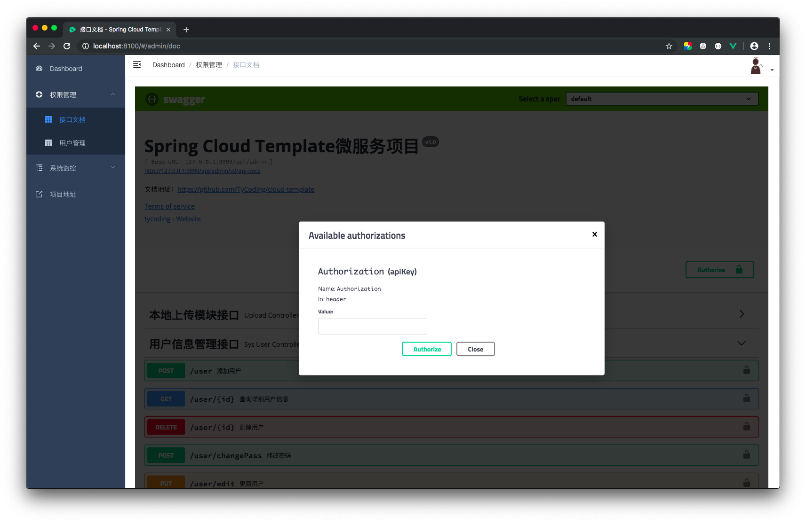
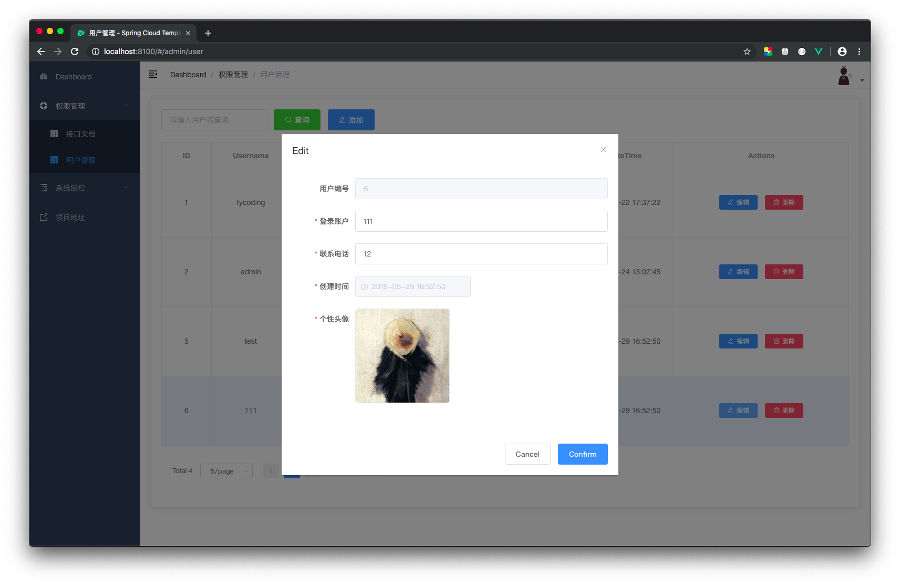
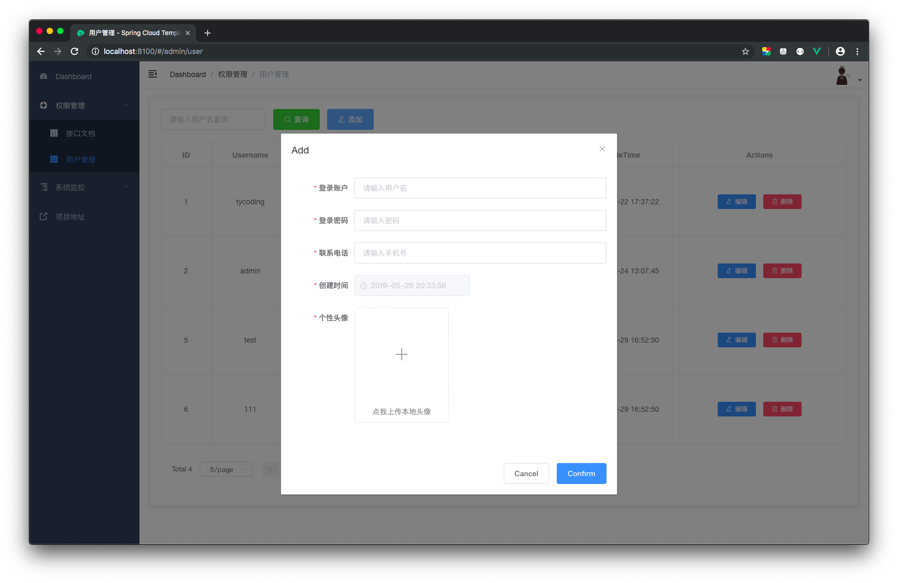
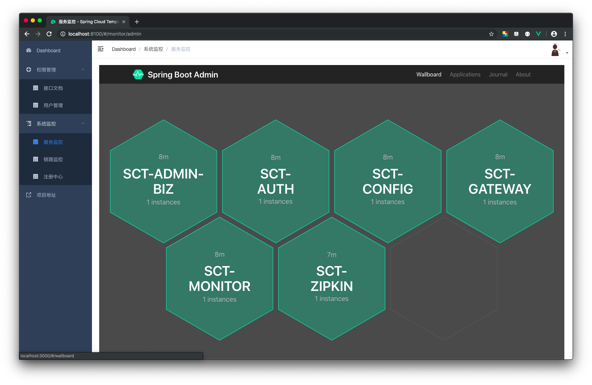

# Spring Cloud Template 分布式微服务系统 -- 后端

## 写在前面

在开始此项目前，请先学习这个基础项目模板 [cloud-template](https://github.com/TyCoding/cloud-template/tree/master/cloud-template) ，并仔细阅读以下开发文档：

[从零开始搭建Spring Cloud脚手架](https://github.com/TyCoding/cloud-template/blob/master/cloud-template/doc/env-1.md)

## 启动说明

1. 修改本地`hosts`文件，添加如下内容（可以通过 [SwitchHosts](http://oldj.github.io/SwitchHosts/) 快速修改）。

```
127.0.0.1 sct-eureka
127.0.0.1 sct-mysql
127.0.0.1 sct-auth
```

2. 修改`sct-config/src/main/resources/`下配置文件中的数据库连接信息，主要涉及`sct-admin-biz-dev.yml`和`sct-auth-dev.yml`两个文件

3. 导入项目根目录下的`base.sql`，建立数据库

默认密码请参看`sct-admin-biz/src/test/PasswordEncoderTest.java`测试类

| Username | Password |
| --- | --- |
| tycoding | tycoding |
| admin | admin |
| test | test |

4. 严格按照如下顺序依次启动服务模块

```
1. EurekaApplication.java -- 服务注册中心
2. ConfigApplication.java -- 服务配置中心
3. MonitorApplication.java -- Spring Boot Admin监控
4. ZipkinApplication.java -- Zipkin链路监控
5. AdminBizApplication.java -- 系统管理模块
6. AuthApplication.java -- 授权模块
7. GatewayApplication.java -- Zuul网关
```

5. 启动前端项目

```shell
$ cd sct-app
$ npm install
$ npm run dev
```

既然都使用了Spring Cloud微服务，必然要配合Vue前端框架使用才更舒服。在 [Spring Cloud Template分布式微服务前端](https://www.tycoding.cn/2019/05/30/cloud/cloud-template-app/) 文档中已经详细介绍了在Spring Cloud项目中如何配合`vue-admin-template`前端模板项目实现基础的CRUD业务，如果你与一定的Vue基础，相信 [cloud-template](https://github.com/TyCoding/cloud-template) 项目的简洁性足够让你快速了解Vue前后端分离式开发流程了。

## Vue组件嵌套页面

Spring Cloud配合Vue单页面应用食用，可能会遇到一些问题，就是如何在Vue组件找那个嵌套Spring Cloud系列框架内置的UI页面，比如Spring Boot Admin监控中心、Eureka注册中心、Zipkin链路监控、Swagger2文档等等，这些框架内部提供了UI界面，但如何把它嵌套进我们的Vue单页面项目中呢？

注意：这部分我们仅是介绍如何实现在Vue组件中嵌套第三方的UI页面，这可能在一些权限管理项目、应用监控项目中常见，毕竟他们已经写好的非常漂亮的界面，我们又有什么理由不用呢？

### 解决方案：`<iframe>`嵌套

很多人说`<iframe>`实现页面嵌套太Low了，But，这确实是一种方便快捷的方式。而我们经常在JSP或者HTML页面中使用`<iframe>`，在Vue单页面程序中仅仅有一个`index.html`，也能实现吗？答案：确实可以。

以下是一个Base模板：`base.vue`

```html
<template>
  <el-card>
    <iframe width="400" id="iframe" frameborder="0" scrolling="auto" :src="url"></iframe>
  </el-card>
</template>

<script>
  export default {
    data() {
      return {
        url: 'http://127.0.0.1:8761/'
      }
    },
    mounted() {
      /**
       * iframe-宽高自适应显示
       */
      const oIframe = document.getElementById('iframe');
      const deviceWidth = document.documentElement.clientWidth;
      const deviceHeight = document.documentElement.clientHeight;
      oIframe.style.width = (Number(deviceWidth) - 255) + 'px'; //数字是页面布局宽度差值
      oIframe.style.height = (Number(deviceHeight) - 20) + 'px'; //数字是页面布局高度差
    },
  }
</script>
```

以上方式，在Vue组件中直接使用`<iframe>`即可加载第三方页面并嵌套到当前Vue组件中，但是由于直接嵌套`<iframe>`中的页面无法自动自适应当前Vue组件的高度、宽度。So，需要使用JS方式计算一下当前Vue组件窗口高度宽度，并应用与当前`<iframe>`窗口。

### 侧边路由导航

既然创建了一个新的组件，必然应该在侧边栏创建一个路由导航。在我们使用的`vue-admin-template`项目中实现起来简单很多，毕竟作者已经帮我们写好了。修改`src/router/index.js`：

```javascript
  {
    path: '/base',
    component: Layout,
    redirect: '/base',
    children: [{
      path: 'base',
      name: 'Base组件',
      component: () => import('@/views/base/index'),
      meta: { title: 'Base组件', icon: 'dashboard' }
    }]
  },
```

这样，在侧边栏就能自动渲染出一个路由导航：`Base组件`


## 功能预览









